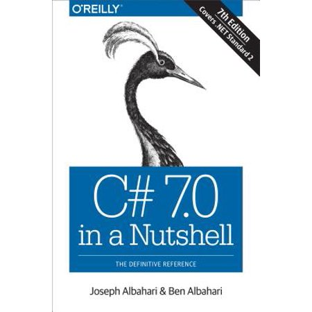

# C# in a Nutshell

This is repository based in the [C# 7.0 in a Nutshell](https://a.co/d/1wJm5vu) written by Joseph Albahari and Ben Albahari. 

This is more likely a quick guide passing through the most important concepts of every chapter.

