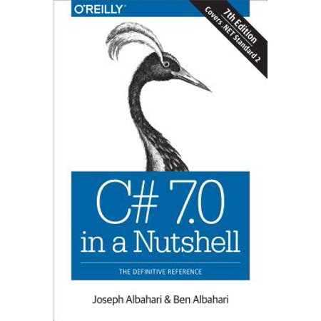

# C# in a Nutshell

This repository is based on the [C# 7.0 in a Nutshell](https://a.co/d/1wJm5vu) book written by Joseph Albahari and Ben Albahari. 

<div style="text-align: center;">

</div>

This repository serves as a practical playground for studying and exploring the main features of C# through hands-on debugging and experimentation.

## Purpose

This repository is designed to facilitate learning C# features through interactive study. Each class demonstrates specific C# concepts and can be studied independently by running the code with breakpoints to understand the execution flow and behavior.

## How to Use

### 1. Select a Feature to Study

Open `csharp-in-a-nutshell/Program.cs` and change the `IPlayground` implementation to the class you want to study:

```csharp
// Example: To study Iterators
IPlayground playground = new IteratorsPlayground();

// Example: To study Lambda Expressions
IPlayground playground = new LambdaExpressionsPlayground();

// Example: To study Delegates
IPlayground playground = new DelegatesPlayground();
```

### 2. Set Breakpoints

1. Open the corresponding class file you want to study (found in the `04_Advanced`, `06_Framework_Fundamentals`, or `19_Reflection_and_Metadata` directories)
2. Set breakpoints at key locations in the code where you want to observe behavior
3. Use F9 (Visual Studio) or click in the gutter to set breakpoints

### 3. Run in Debug Mode

1. Press F5 to start debugging (or use Run → Start Debugging)
2. The program will execute and pause at your breakpoints
3. Use the debugger features to:
   - **Step Through** (F10/F11): Step over or into methods
   - **Inspect Variables**: Hover over variables or use the Watch window
   - **Call Stack**: See the execution flow
   - **Immediate Window**: Evaluate expressions

### 4. Study the Code

- Observe how variables change during execution
- Understand control flow by stepping through the code
- Examine how different C# features work at runtime
- Experiment by modifying values in the debugger or code

## Available Classes

### Advanced Features (`04_Advanced/`)
- `IteratorsPlayground` - Enumeration and Iterators (`EnumerationAndIterators.cs`)
- `LambdaExpressionsPlayground` - Lambda Expressions (`LambdaExpressions.cs`)
- `DelegatesPlayground` - Delegates (`Delegates.cs`)
- `EventsPlayground` - Events (`Events.cs`)
- `ExtensionMethodsPlayground` - Extension Methods (`ExtensionMethods.cs`)
- `AttributesPlayground` - Attributes (`Attributes.cs`)
- `DynamicBindingPlayground` - Dynamic Binding (`DynamicBinding.cs`)
- `NulleableTypesPlayground` - Nullable Types (`NulleableTypes.cs`)
- `OperatorsPlayground` - Operators (`Operators.cs`)
- `TestTryCatch` - Exception Handling (`TryCatch.cs`)
- `TuplesPlayground` - Tuples (`Tuples.cs`)
- `UnsafeCodeAndPointersPlayground` - Unsafe Code and Pointers (`UnsafeCodeAndPointers.cs`)

### Framework Fundamentals (`06_Framework_Fundamentals/`)
- `DatesAndTimesPlayground` - Dates and Times (`DatesAndTimes.cs`)
- `EnumsPlayground` - Enumerations (`Enums.cs`)
- `EqualityComparisionPlayground` - Equality Comparison (`EqualityComparision.cs`)


## Project Structure

```
csharp-in-a-nutshell/
├── Program.cs                 # Entry point - change the IPlayground here
├── IPlayground.cs            # Interface that all playground classes implement
├── 04_Advanced/              # Advanced C# features
├── 06_Framework_Fundamentals/ # Framework fundamentals
└── 19_Reflection_and_Metadata/ # Reflection features
```

## Requirements

- .NET 6.0 SDK or later
- Visual Studio, Visual Studio Code, or Rider (for debugging)

## Tips

- **One class at a time**: Focus on one feature by changing only the class in `Program.cs`
- **Use step debugging**: F11 to step into methods, F10 to step over
- **Watch key variables**: Add variables to the Watch window to monitor their values
- **Read the code**: Don't just run it - read through the implementation to understand what it's demonstrating
- **Experiment**: Modify the code and see how it affects the behavior

This repository is more likely a quick guide passing through the most important concepts of every chapter, designed for hands-on learning through debugging.


